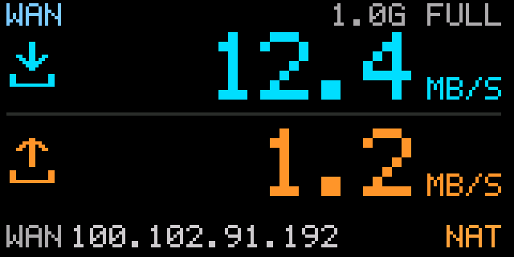
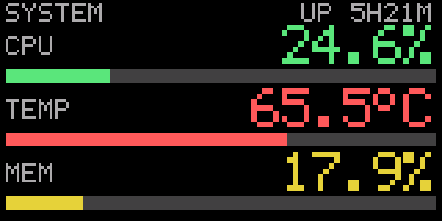
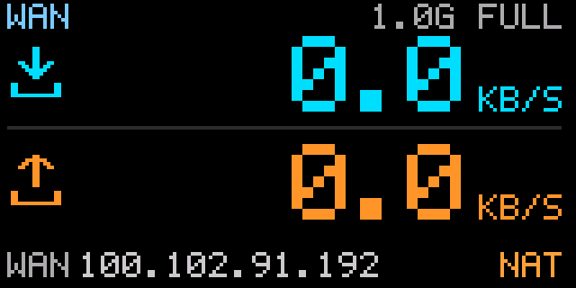

# MSU2 USB 小屏 · iStoreOS 移植版

在 **iStoreOS / OpenWrt 软路由** 上直接驱动 MSU2 USB 小屏（CH32x035，160×80），实时显示 WAN 网速、CPU 温度、内存、CPU 占用、运行时长、时钟和在线客户端数。

> 适用设备：MSU2 / CH32x035（USB VID:PID `1a86:fe0c`）
> 已验证环境：Radxa E20C（4×A53 / 2 GB）+ iStoreOS 25.12.5 + Python 3.13.9
> 项目部署目录：`/mnt/mmc1-4/msu2d`
> 最后整理：2026-09-14





## 功能

- **网速页**：WAN 协商速率、实时下行/上行速度、WAN 口 IP、CGNAT（运营商大内网）`NAT` 标记。
- **系统页**：CPU 占用率、CPU 温度、内存占用率，各带进度条；右上角显示运行时长。
- **时钟页**：大号时间、秒、日期、星期，以及基于 ARP 活跃条目的在线客户端数。
- **自动轮播**：默认按“网速 → 系统 → 时钟”轮播，每页停留时间可配置。
- **LuCI 网页控制**：服务菜单“USB副屏 (MSU2)”，支持启用/停用、页面选择、刷新间隔、轮播时间、屏幕方向。
- **procd 服务化**：支持开机启动、异常自动拉起、运行状态和最近日志查看。
- **零第三方依赖**：串口、渲染、PNG 预览、指标采集全部仅使用 Python 标准库，无需 pip、PIL、pyserial、numpy。

## 运行要求

| 项目 | 要求 |
| --- | --- |
| 系统 | iStoreOS / OpenWrt，Linux 内核提供 `/proc`、`/sys`、termios |
| Python | Python 3，路由器实测 `/usr/bin/python3` 3.13.9 |
| 屏幕 | MSU2 / CH32x035，分辨率 160×80，VID:PID `1a86:fe0c` |
| 串口 | 默认 `/dev/ttyACM0`；程序会按 VID:PID 自动扫描 |
| 权限 | 安装和运行需要 root；串口必须由单个进程独占 |
| 网页控制 | 可选，需要 LuCI Lua 运行时（`luci-compat`） |

## 快速开始

### 1. 一键安装（推荐）

把 `dist/msu2d-install-1.0.sh` 上传到路由器后执行：

```sh
scp dist/msu2d-install-1.0.sh root@192.168.10.1:/tmp/
ssh root@192.168.10.1
sh /tmp/msu2d-install-1.0.sh
```

默认安装到 `/mnt/mmc1-4/msu2d`；若该挂载点不可用，会回退到 `/opt/msu2d`。安装脚本会：

1. 检查 Python 3（缺失时尝试通过 `apk` / `opkg` 安装 `python3-light`）；
2. 复制程序、文档、LuCI 文件和服务脚本；
3. 安装 UCI 配置 `/etc/config/msu2`（已存在时保留原配置）；
4. 安装 `/etc/init.d/msu2d` 并启动服务；
5. 可选安装 LuCI 网页控制。

需要开机自启时执行：

```sh
/etc/init.d/msu2d enable
```

### 2. 源码目录安装

把仓库内容上传到路由器后执行：

```sh
cd /mnt/mmc1-4/msu2d
sh tools/install.sh
```

只修复或重装 LuCI 页面：

```sh
sh /mnt/mmc1-4/msu2d/tools/install_luci.sh
```

### 3. 不安装、直接试运行

先停止服务，避免串口被占用：

```sh
/etc/init.d/msu2d stop
cd /mnt/mmc1-4/msu2d/src
python3 -m msu2.main --page auto --interval 1 --rotate 15
```

只显示一页：

```sh
python3 -m msu2.main --page net       # 网速
python3 -m msu2.main --page sys       # CPU / 温度 / 内存
python3 -m msu2.main --page clock     # 时间 / 在线客户端
```

跑固定帧数后自动退出：

```sh
python3 -m msu2.main --frames 60 --interval 1
```

## 网页控制

安装 LuCI 页面后打开：

```text
http://192.168.10.1/cgi-bin/luci/admin/services/msu2
```

菜单路径：**服务 → USB副屏 (MSU2)**

可配置项：

| 配置 | 取值 | 说明 |
| --- | --- | --- |
| `enabled` | 0 / 1 | 是否接管屏幕 |
| `page` | auto / net / sys / clock | 显示页面 |
| `interval` | 0.2–60 | 刷新间隔，秒 |
| `rotate` | 3–3600 | auto 模式每页停留秒数 |
| `direction` | 0–7 | 0=正向、1=180°、2/3=镜像、4/5=90°、6/7=镜像+90° |

命令行等价配置：

```sh
uci set msu2.settings.enabled=1
uci set msu2.settings.page=auto
uci set msu2.settings.interval=1
uci set msu2.settings.rotate=15
uci set msu2.settings.direction=0
uci commit msu2
/etc/init.d/msu2d restart
```

服务管理：

```sh
/etc/init.d/msu2d start | stop | restart
/etc/init.d/msu2d enable | disable
logread -e msu2d
```

## 页面预览

| 页面 | 预览 |
| --- | --- |
| 网速页（空闲） |  |
| 图标细节 |  |

更多实测效果图位于 `docs/images/`。

## 目录结构

```text
forIstoreOS/                         # 仓库根目录
├── README.md                        # 项目说明（本文件）
├── AGENTS.md                        # 协议要点、开发铁律、已知坑
├── LICENSE                          # MIT License
├── .gitignore
├── .gitattributes
├── docs/
│   ├── 操作手册.md                  # 安装、使用、排障手册
│   ├── 可行性方案.md                # 技术验证与实测数据
│   ├── 备份说明.md                  # 备份、还原、发布说明
│   └── images/                      # 屏幕预览图
├── src/msu2/
│   ├── __init__.py
│   ├── transport.py                 # 串口、协议、完整写入、状态管理
│   ├── canvas.py                    # RGB565 帧缓冲、压缩编码、图标
│   ├── font.py                      # 5×7 点阵字库
│   ├── metrics.py                   # /proc、/sys 指标采集
│   ├── pages.py                     # 三页布局渲染
│   └── main.py                      # CLI、主循环、状态文件
├── tools/
│   ├── install.sh                   # 一键安装/升级
│   ├── install_luci.sh              # 只安装/修复 LuCI
│   ├── uninstall.sh                 # 卸载服务和 LuCI 页面
│   ├── preview.py                   # 生成页面 PNG 预览
│   ├── dir_test.py                  # 屏幕方向自检
│   └── package.sh                   # 从仓库重新生成 dist/ 发布包
├── etc/
│   ├── config/msu2                  # UCI 默认配置
│   └── init.d/msu2d                 # procd 服务脚本
├── luci/
│   ├── controller/msu2.lua          # LuCI 菜单注册
│   └── model/cbi/msu2/settings.lua  # LuCI 设置页
└── dist/                            # 发布包和完整备份
```

运行时生成的 `/tmp/msu2d.status`、`__pycache__/`、`var/` 不提交到 Git。

## 开发与预览

修改页面布局后，先在电脑或路由器上生成预览图，不要反复刷屏：

```sh
cd /mnt/mmc1-4/msu2d
python3 tools/preview.py --out /tmp/preview --scale 4
ls -l /tmp/preview/
```

只做语法检查（不会访问屏幕）：

```sh
cd /mnt/mmc1-4/msu2d
python3 -m compileall -q src/msu2
```

屏幕方向自检（会短暂接管屏幕，每屏默认 6 秒）：

```sh
cd /mnt/mmc1-4/msu2d/src
python3 ../tools/dir_test.py
```

## 协议与安全边界

改 `transport.py` / `canvas.py` 前请先阅读 `AGENTS.md`：

- `LCD_ADD`（设置显示区域）**只在进入页面时发送一次**，连续刷新绝不再发；
- 一帧数据必须完整写出，不能截断；
- 等待像素数据期间不要插入读寄存器、读按键、切方向等命令；
- 帧数据按 1024 字节分块并等待 `TIOCOUTQ` 归零；
- 显示态本来就不回显、不发心跳，这是正常现象；
- 若设备固件卡死，只能物理断电/拔插 USB，USB authorized 软复位无效。

## 故障排查

先按下面顺序判断：

```bash
lsusb | grep -i ch32                     # 设备是否在
ls -l /dev/ttyACM0                       # 串口节点
cat /dev/ttyACM0 | hexdump -C            # 待机态应有 10Hz 心跳
cat /sys/class/thermal/thermal_zone0/temp
cat /sys/class/net/pppoe-wan/statistics/rx_bytes
```

判断顺序：**设备在不在 → 待机态心跳 → 显示态看 TIOCOUTQ → 卡死则物理断电**。

完整排障流程见 [操作手册](docs/操作手册.md)。

## 发布包

| 文件 | 用途 |
| --- | --- |
| `dist/msu2d-install-1.0.sh` | 单文件自解压安装包，推荐分发 |
| `dist/msu2d-1.0.tar.gz` | 纯源码压缩包，解包后运行 `tools/install.sh` |
| `dist/msu2d-backup-20260912.tar.gz` | 2026-09-12 完整备份，解包还原到 `/mnt/mmc1-4/msu2d` |
| `dist/msu2d-backup-20260912.tar.gz.md5` | 备份包 MD5 校验文件 |

重新打包：`sh tools/package.sh 1.0`。发布包说明见 `dist/README.md`，还原步骤见 [备份说明](docs/备份说明.md)。

## 文档

- [操作手册](docs/操作手册.md)：日常安装、网页控制、命令速查、故障处理、协议速查。
- [可行性方案](docs/可行性方案.md)：从 Windows 版移植到 iStoreOS 的技术验证、帧格式和实测数据。
- [备份说明](docs/备份说明.md)：源码目录、发布包、备份还原和迁移说明。
- [AGENTS.md](AGENTS.md)：给后续开发者/AI 代理的项目规则和协议边界。

## 许可证

本项目采用 MIT License，详见 [LICENSE](LICENSE)。
上游参考实现：`MSU2_MINI_V2.py`（只读参考，不随本仓库修改）。
